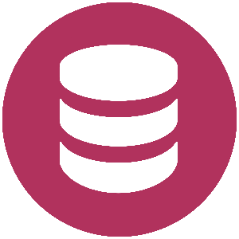

  
  <h1>Kevacoin.js</h1>

The easiest way to build decentralized key-value stores using the latest blockchain technology.

---

#### NOTE: this project is a work in progress, and development requirements are subject to change

### Links

- [About](#about)
- [Getting Started](#getting-started)
- [How to Contribute](#contributing)
- [Support the devs](#support)

  <h3>Why kevacoin?</h3>

Given the state of the world, and the growing reliance on increasingly <b>massive</b> hosting providers like Azure, GCP, and the iron (silicon?) fist of AWS, it's becoming harder to trust that critical infrastructure will always remain "up", and more importantly <b>safe</b>.

If AWS goes out or their core infrastructure gets compromised, virtually half the internet could go out with it! And you can't really rely on Google, they are _constantly_ deprecating projects for no good reason besides moving you to the next replacement app. So if you really want your site's data to remain both off premesis (i.e. not on a random HDD you have attached to a Raspberry Pi) and accessible to those consuming your content, you need something distributed, accessible, and safe.

That's where Kevacoin comes in!

### What is Kevacoin?

For a deep dive, I recommend checking out the [official webstite](https://kevacoin.org), but in a nutshell, Kevacoin is much more than just another dime-a-dozen Bitcoin clone or meme coin that retail investors "HODL" and claim will go "to the moon!" if you wait long enough. It takes the _years_ of work done in the blockchain/crypto sphere, boils it down to a few easy commands, and makes it accessible to virtually anyone with a computer and some time.

### What is Kevacoin.js then?

While Kevacoin is relatively simple to consume as a user (using pre-created tools from the developers), it wasn't so easy as a developer to get started. These days, if your service doesn't have a library written for it in some popular web-connected language (i.e. JS, Python, Go...) then mass adoption is extremely difficult. This library aims to fix that!

With an easy to use `KevaClient` class, you just point it at a running instance of `kevacoind` (more on this later) along with a username and password, and you're set!

  <h3>Getting Started</h3>

#### Things you'll need

- A Linux environment (Windows/macOS testers needed!)
- [NodeJS v10+ (ideally v15.14.0 or latest)](https://nodejs.org/en/download/) + a JS package manager (yarn/npm) installed and on your $PATH
- A relatively fast CPU for running the daemon to connect to the Kevacoin chain

#### How to start

1. Create or navigate to a node project you'd like to connect to Keva (to init: run `npm init` or `yarn init` in an empty directory)
2. Run `yarn add @dukeferdinand/kevacoin-js` or `npm install --save @dukeferdinand/kevacoin-js` to add this project to yours
<!-- TODO: Add more details -->
3. To be continued...

  <h3>Contributing</h3>

#### Things you'll need

- Everything from the [getting started section](#getting-started)
- `yarn` package manager
- Git + a GitHub account
- Some kevacoin to seed your test wallet in your development environment (you can mine this overnight and you should have a good amount in the morning if you don't trust exchanges)

#### Implementing new features

1. Clone this repo + `yarn install`
2. Add your method(s) to the `KevaClient` if related to JSON-RPC commands, otherwise use your judgement (it will all be reviewed in the end!)
<!-- TODO: Add more details -->
3. To be continued...

  <h3>
    Support
  </h3>

#### Want to support kevacoin-js?

The best way to support this project is by shipping code and making PRs for new features. Even if if that just means writing example code, every little bit helps!

#### What if I'm not a developer?

That's okay! You can still help Kevacoin as a whole by either mining Kevacoin (mining supports the infrastructure by lending us your hash power to keep the data flowing), or by promoting Kevacoin to everyone you know!

#### Just want to donate?

That's appreciated too, but make sure you consider the other options as those help more than just me ;)

- KEVA (Kevacoin) address - `VZ1W7FD4biBuaDQvPdLLQkyJm6KhjL7iGa`
- RVN (Ravencoin) address - `RVn2WxQdnMZw5SR31ehUHPLDMDrG3bhPV9`
- DOGE (Dogecoin) address - `DFBQjyivrpmeCPJoP26PRhGX4FLJQEGALJ`
